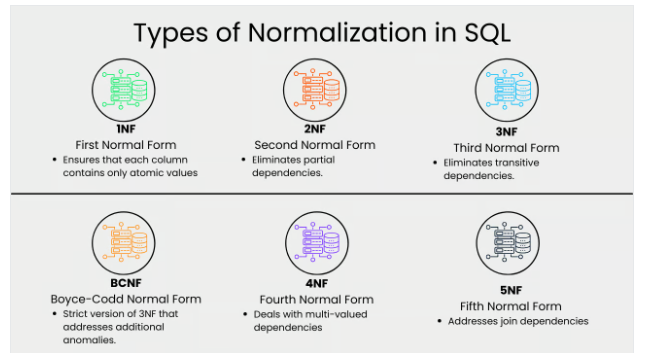

# ACID Properties in DBMS

  
ACID stands for Atomicity, Consistency, Isolation, and Durability. These four key properties define how a transaction should be processed in a reliable and predictable manner, ensuring that the database remains consistent, even in cases of failures or concurrent accesses.

## 1. Atomicity.
Atomicity ensures that a transaction is atomic, it means that either the entire transaction completes fully or doesn't execute at all. There is no in-between state i.e. transactions do not occur partially. If a transaction has multiple operations, and one of them fails, the whole transaction is rolled back, leaving the database unchanged.

## 2. Consistency.
Consistency ensures that a database remains in a valid state before and after a transaction. This means that, a transaction should only take the database from one valid state to another. If a transaction violates any database rules or constraints, it should be rejected, ensuring that only consistent data exists after the transaction.

## 3. Isolation. 
Isolation ensures that multiple transactions can occur concurrently without leading to the inconsistency of the database state. Transactions occur independently without interference. Changes occurring in a particular transaction will not be visible to any other transaction until that particular change in that transaction is written to memory or has been committed.This property ensures that when multiple transactions run at the same time, the result will be the same as if they were run one after another in a specific order.

## 4. Durability. 
This property ensures that once the transaction has completed execution, the updates and modifications to the database are stored in and written to disk and they persist even if a system failure occurs. These updates now become permanent and are stored in non-volatile memory. In the event of a failure, the DBMS can recover the database to the state it was in after the last committed transaction, ensuring that no data is lost.

# DATABASE NORMALIZATION 
## What is database normalization: 

Database normalization is a process used for data modeling or database creation where you organize your data and tables so they can be added and updated efficiently.

## Why is database normalization important: 
Normalization plays a crucial role in database design. Here are several reasons why it’s essential:

* Reduces redundancy: Redundancy is when the same information is stored multiple times, and a good way of avoiding this   is by splitting data into smaller tables.
* Improves query performance: You can perform faster query execution on smaller tables that have undergone normalization.
* Minimizes update anomalies: With normalized tables, you can easily update data without affecting other records.
* Enhances data integrity: It ensures that data remains consistent and accurate.

## Types of Normalization in DBMS:  

  1.  First Normal Form (1NF):  
 Ensures that the database table is organized such that each column contains atomic (indivisible) values, and each record is unique. This eliminates repeating groups, thereby structuring data into tables and columns.

  2.  Second Normal Form (2NF):  
 It requires all non-key attributes to be fully functional on the primary key.What this means, is that there should be a direct relationship between each column and the primary key, and not between other columns.

 3. Third normal Form (3NF):  
  Extends 2NF by ensuring that all non-key attributes are not only fully functional on the primary key but also independent of each other. This eliminates transitive dependency.
 
  4. Boyce-Codd Normal Form (BCNF):  
 A refinement of 3NF that addresses anomalies not handled by 3NF. It requires every determinant to be a candidate key, ensuring even stricter adherence to normalization rules.

  5. Fourth Normal Form (4NF):  
 Addresses multi-valued dependencies. It ensures that there are no multiple independent multi-valued facts about an entity in a record.

  6. Fifth Normal Form (5NF):  
 5NF is the highest normalization level that addresses join dependencies. It is used in specific scenarios to further minimize redundancy by breaking a table into smaller tables.

# Examples of Normalization:

## First Normal Form:  
* Each table cell should contain a single value.  
* Each record needs to be unique.

Consider the following table:

| EMP_ID | EMP_NAME | EMP_PHONE |           EMP_STATE
|------- |----------|------------|---------------------|
| 14     | John     | 7272826385,9064738238|NAIROBI |
| 20     | Harry    | 8574783832      |     KITALE  | 
|12      | Sam      | 7390372389,858930302| ELDORET |   

The column EMP_PHONE, contains multiple phone numbers for the employees. This table is not in 1NF. To normalize it, we have to decompose the column to give the table below:  

| EMP_ID | EMP_NAME | EMP_PHONE |           EMP_STATE
|------- |----------|------------|---------------------|
| 14     | John     | 7272826385|NAIROBI |
|14      | John     |9064738238 | NAIROBI|
| 20     | Harry    | 8574783832| KITALE | 
|12      | Sam      |7390372389|  ELDORET| 
|12      | Sam      | 858930302| ELDORET | 

## Second Normal Form: 
* Each non-key attribute must depend on the entire primary key.  
* Be in 1NF  
* Single Column Primary Key that is not functionally dependent on any subset of candidate key relation

Consider the following table: 

|TEACHER_ID | SUBJECT | TEACHER_AGE|
|------- |----------|------------|
| 25     | Chemistry| 30 |
|25      | Biology  | 30|
| 47     | English    | 35 | 
|83      | MATH     |38| 
|83     | Computer      | 38| 

In the given table, non-prime attribute TEACHER_AGE is dependent on TEACHER_ID which is a proper subset of a candidate key. That's why it violates the rule for 2NF.

To convert the given table into 2NF, we decompose it into two tables:

Teacher_Detail Table:
| TEACHER_ID | TEACHER_AGE |
|------------|--------------|
|25          | 30           |
|47          | 35           |
|83          | 38           |

TEACHER_SUBJECT TABLE: 
| TEACHER_ID | SUBJECT |
|------------|--------------|
|25          | Chemistry    |
|25          | Biology      |
|47          | English      |
|83          |MATH          |
|83          | Computer     |  

# Disadvantages of Normalization in DBMS
While normalization DBMS offers numerous advantages, it also has some drawbacks.

## 1. Requires Complete Understanding of User Needs
Database normalization in DBMS requires a complete understanding of user needs before building the database. This means that careful analysis and planning are necessary to determine the appropriate level of normalization. Failing to understand user requirements can lead to a poorly designed database that is difficult to maintain and update.

## 2. Performance Degradation in Higher Normal Forms
As the level of normalization increases, i.e., moving towards higher normal forms such as 4NF and 5NF, the performance of the database can degrade. This is because more complex join operations are required to retrieve data from multiple tables, resulting in slower query execution.

## 3.Time-Consuming Process
Normalizing relations to higher degrees can be a time-consuming process. It involves analyzing data dependencies, identifying anomalies, and restructuring the database accordingly. This can be a complex task, especially for large databases with numerous tables and relationships.

## 4.Careless Decomposition can Lead to Problems
If the decomposition process is not carefully executed, it can lead to a poorly designed database. Careless decomposition can result in unnecessary joins, data redundancy, and increased complexity. This can cause serious problems in terms of data management and query performance.

